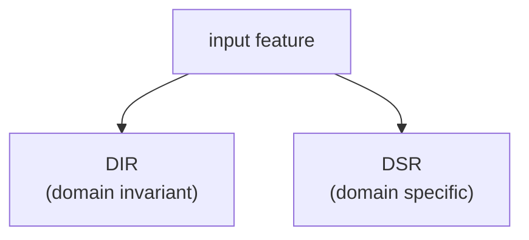
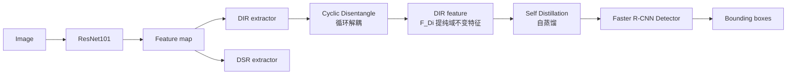

### 背景：

在传统目标检测中，通常假设训练数据和测试数据是同分布的，但是在现实场景中并不是这样，而是会产生“域偏移”。

现有解决**域偏移**的方法：Domain Adaptation（领域自适应）&& Domain Generalization（领域泛化），其中

**领域自适应：**

需要**源域数据，目标域数据**，即训练时知道目标环境，但该方法无法处理未知环境；

**领域泛化：**

训练时，训练多个源域，以求泛化到未知目标域，但是该方法需要收集多个源域，成本高。

So，有没有一种方法，不用收集多个源域也能将目标检测器泛化到多个未知源域呢？


### 创新点：

#### ONE：提出 Single-DGOD 新任务

（概念创新）

只用一个训练环境，学习**域不变特征**——domain-invariant representation (DIR)——目标本身特征而不是背景信息。

#### TWO：Cyclic Disentanglement（循环解耦模块）

核心思想：输入 feature，将其分为域不变和域特有



其中 DIR 包含**object shape**&&**object category**；DSR 包含天气&&光照...

**Question：**

以前的方法都需要**domain label**（域名标签，天气状况，光照条件），但是在 Single-DGOD 没有

**Solve:**Cyclic Disentanglement

```
Feature F

 ↓

DIR extractor
DSR extractor


得到:

Fdi
Fds


然后反向输入:

Fdi → extractor

Fds → extractor

再次分离
```

通过循环重新映射和对比损失约束，使 DIR 和 DSR 特征逐渐分离。

该阶段包含两个 loss 函数：

$$
\mathcal{L}_{gc}=-\left(\log \frac{\exp \left(\operatorname{sim}\left(F_{d i}, F_{i 2 i}\right) / \tau\right)}{\sum_{j=0}^{1} \exp \left(\operatorname{sim}\left(F_{d i}, G[j]\right) / \tau\right)}+\log \frac{\exp \left(\operatorname{sim}\left(F_{d s}, F_{s 2 s}\right) / \tau\right)}{\sum_{j=0}^{1} \exp \left(\operatorname{sim}\left(F_{d s}, D[j]\right) / \tau\right)}\right),
$$

$$
\mathcal{L}_{i c}=-\log \frac{\exp \left(\operatorname{sim}\left(P, P_{i 2 i}\right) / \tau\right)}{\sum_{j=0}^{1} \exp \left(\operatorname{sim}\left(P, Q[j]\right) / \tau\right)},
$$

**这两个 loss 在干什么？**

**先看懂记号：**

- `sim(a, b)`：两张特征图的**余弦相似度**（逐元素算余弦相似度后取平均）。值越大 = 越像。
- `τ`（温度）：缩放相似度的超参数，论文里设 **1.0**。它控制对比的“软硬”——τ 越小，模型对“拉近/推远”越敏感。
- 反向（循环）过程会产生 4 个特征：`F_i2i = EDIR(F_di)`、`F_i2s = EDSR(F_di)`（F_di 分别再过一遍 DIR/DSR 提取器），`F_s2i = EDIR(F_ds)`、`F_s2s = EDSR(F_ds)`。
- 这种“分子是正配对，分母是正配对+负配对”的结构叫 **InfoNCE 对比损失**（对比学习里最常见的写法，如 SimCLR）。

**Lgc（全局级）在干什么：**

公式是两个 `log(...)` 相加，结构都是 `log[ 正配对相似度 / ( 正配对 + 负配对 ) ]`：

- **第 1 个 log**：分子 `sim(F_di, F_i2i)`，分母 `sim(F_di, F_i2i) + sim(F_di, F_i2s)`（G = [F_i2i, F_i2s]）
  - 翻译：**F_di（域不变）应该跟“它再过一遍 DIR 提取器”（F_i2i）更像，跟“它再过一遍 DSR 提取器”（F_i2s）更不像。**
- **第 2 个 log**：分子 `sim(F_ds, F_s2s)`，分母 `sim(F_ds, F_s2s) + sim(F_ds, F_s2i)`（D = [F_s2s, F_s2i]）
  - 翻译：**F_ds（域特有）应该跟“它再过一遍 DSR 提取器”（F_s2s）更像，跟“它再过一遍 DIR 提取器”（F_s2i）更不像。**

> 为什么这样能解耦？如果两个提取器分得不够干净——比如 F_di 里还混着域特有信息——那么 F_di 过 DSR 提取器会输出和它很像的东西（sim(F_di, F_i2s) 偏大），损失就会惩罚它。**只有当 EDIR/EDSR 真的把“不变”和“特有”分开，这个损失才能被压到最低。** 循环 + 共享参数 + 这个损失三者合在一起，逼着两个提取器越分越干净。

**Lic（实例级）在干什么：**

比 Lgc 多了一步 **RoI-Alignment（抠区域）**：先用 F_di 跑 RPN 得到目标候选框 O，再把同样的框分别作用到 F_di、F_i2i、F_i2s 上，抠出对应区域的实例特征 P、P_i2i、P_i2s。

- 公式只有 1 个 log：分子 `sim(P, P_i2i)`，分母 `sim(P, P_i2i) + sim(P, P_i2s)`（Q = [P_i2i, P_i2s]）
  - 翻译：**对每一个目标实例，它从 F_di 抠出的特征 P，应该更像“从 F_i2i 抠出的同一个实例”（P_i2i），更不像“从 F_i2s 抠出的实例”（P_i2s）。**

**Lgc 和 Lic 的区别（为什么要两个）：**

|              | Lgc（全局级）                 | Lic（实例级）                          |
| ------------ | ----------------------------- | -------------------------------------- |
| 作用在       | 整张特征图                    | 抠出来的目标实例区域                   |
| 保证         | 整体特征分布的“不变/特有”分离 | 每个物体实例层面的分离                 |
| 对检测的意义 | 特征层面解耦                  | 真正决定检测结果（物体区域）的层面解耦 |

两者相加得到 **Lcd = Lgc + Lic**，保证解耦在“全局分布”和“实例局部”两个尺度上都成立。

对比损失 = **“对的配对拉近，错的配对推远”**。循环解耦定义了什么叫对/错配对——**域不变特征再过一遍“不变提取器”应该还是不变（对），再过一遍“特有提取器”应该变（错）；域特有特征反过来。** 两个损失分别在“整张图”和“单个物体”两个尺度上执行这条原则。

#### **THREE：**DIR-based Self-Distillation（**基于 DIR 的自蒸馏法**）

得到提纯后的 DIR 之后，把**FDi**当作 teacher，然后用**FDi**指导**backbone**中间层学习，使其专注于域不变特征

```
Teacher:

DIR feature


Student:

Backbone feature


loss:

feature distance
+
classification KL divergence
```

使模型更具泛化能力

既然有了**TWO**的 FDi 为什么还要去做**THREE**？

一个比喻，backbone 中间层无法提取域不变特征，可视作一个脏水管，而**TWO**则是在脏水管后面加了个**过滤器**，可以提取到域不变特征，但是，为了更进一步净化水源，可以用**干净的水（FDi）**反过来清洗 backbone，即自蒸馏，这样 backbone 也可以提取域不变特征。

**自蒸馏阶段的两个 loss：**

**Lfc（特征级约束）**——把 F1/F2/F3 投影进“老师空间”后，逐像素拉近和 Fdi 的距离：

$$
\mathcal{L}_{f c}=\operatorname{dist}\left(\varphi_{1}\left(F_{1}\right), F_{d i}\right)+\operatorname{dist}\left(\varphi_{2}\left(F_{2}\right), F_{d i}\right)+\operatorname{dist}\left(\varphi_{3}\left(F_{3}\right), F_{d i}\right)
$$

- `φ1/φ2/φ3`：1×1 卷积投影层（φ1: u→c, φ2: v→c, φ3: c→c），把学生特征对齐到 Fdi 的通道数 c
- `dist(·,·)`：距离函数，论文用 **L2 范数**
- 作用：让骨干中间层特征 F1/F2/F3 都富含域不变信息（整体逼近 Fdi）

**Lcc（分类级约束）**——在物体实例上做 KL 散度对齐：

$$
\mathcal{L}_{c c}=\mathrm{KL}\left(y, y_{1}\right)+\mathrm{KL}\left(y, y_{2}\right)+\mathrm{KL}\left(y, y_{3}\right)
$$

- 先对 F1/F2/F3 做 RoI-Alignment，抠出实例特征 P1/P2/P3，再过三个分类器得到预测概率 y1/y2/y3
- `y`：基于 Fdi 的实例特征 P 算出的分类概率（老师的预测）
- `KL(·,·)`：KL 散度，让学生的预测逼近老师的预测
- 作用：让中间层特征学到“类别相关”的域不变知识，提升检测精度

**两者相加得到自蒸馏总损失：**

$$
\mathcal{L}_{s d}=\mathcal{L}_{f c}+\mathcal{L}_{c c}
$$

### 模型选择：

基础检测器使用**Faster R-CNN**-->目标检测

Backbone 使用**ResNet-101**-->特征提取



### 训练流程（端到端联合优化）

**总损失（论文公式 7）**：

$$L = L_{rpn} + L_{cls} + L_{loc} + \lambda(L_{cd} + L_{sd}), \quad \lambda = 0.01$$

| 损失项                     | 作用                               |
| -------------------------- | ---------------------------------- |
| $L_{rpn}$                  | RPN 损失：区分前景/背景 + 精修锚框 |
| $L_{cls}$                  | 分类损失（检测头）                 |
| $L_{loc}$                  | 框回归损失（检测头）               |
| $L_{cd} = L_{gc} + L_{ic}$ | 循环解耦损失（全局级 + 实例级）    |
| $L_{sd} = L_{fc} + L_{cc}$ | 自蒸馏损失（特征级 + 分类级）      |

**训练细节（论文 Implementation Details）**：

```
模型：Faster R-CNN + ResNet-101（ImageNet 预训练初始化）
投影层：T1/T2/T3 = 三层卷积 + BatchNorm（随机初始化）
优化器：SGD（momentum 0.9，weight decay 0.0001）
学习率：0.001；batch size：4
训练方式：端到端（所有模块一起优化）
```

**训练流程（数据流）**：

```
源域图片（白天晴天）
   ↓ backbone 提取特征 Fb
   ↓ ① 循环解耦：EDIR/EDSR 拆出 Fdi/Fds
      → 反向再解耦 → 对比损失 Lcd 逼提取器分干净
   ↓ ② 自蒸馏：Fdi 当老师，蒸馏到骨干中间层 F1/F2/F3
      → Lfc（特征距离）+ Lcc（分类 KL）→ Lsd
   ↓ ③ 检测：基于 Fdi 分支 → RPN → 分类 + 回归
   ↓ 联合优化：L = Lrpn + Lcls + Lloc + λ(Lcd + Lsd)
```

### 推理流程（只用 Fdi）

**论文原文**：_“During inference, we take the predictions calculated based on Fdi as the detection results.”_

```
测试图（夜晚/雨/雾，未知域）
   ↓ backbone 提取特征
   ↓ EDIR 解耦出 Fdi（域不变特征）
   ↓ 基于 Fdi 直接做检测（RPN → 分类 + 回归）
   ↓ 输出框 + 类别
```

**关键点**：

1. **推理时不用 Fds**（域特有特征被丢弃）——只保留域不变信息做检测；
2. **自蒸馏的效果内化**：推理时不需要显式跑自蒸馏（那是训练时的约束），骨干中间层已经被“洗干净”；
3. **标准单次前向**：没有测试时操作（不演化、不调整），和 Cauvis 一样属于“零测试时开销”派。

### **数据集：**

论文构建**Diverse-Weather Dataset**，包含五种环境：白天晴天，夜晚晴天，黄昏雨天，夜晚雨天，白天雾天。

七种目标：bus，bike，car，motor，person，rider，truck

### **评估指标：**

mAP

### 实验结果：

| 测试域                    | Baseline(Faster R-CNN) mAP | 本文方法 mAP | mAP 提升 |
| ------------------------- | -------------------------- | ------------ | -------- |
| Night-sunny（夜晚晴天）   | 33.5%                      | 36.6%        | +3.1%    |
| Dusk-rainy（黄昏雨天）    | 26.6%                      | 28.2%        | +1.6%    |
| Night-rainy（夜晚雨天）   | 14.5%                      | 16.6%        | +2.1%    |
| Daytime-foggy（白天雾天） | 31.9%                      | 33.5%        | +1.6%    |

### 消融实验：

| 模块                | 作用     |
| ------------------- | -------- |
| Forward disentangle | 普通解耦 |
| Cyclic Disentangle  | 循环解耦 |
| Self Distillation   | 自蒸馏   |

Daytime sunny:

```
baseline:
48.7

+
Cyclic:
52.3

+
Self-distillation:
56.1
```

Night sunny:

```
30.4


34.2


36.6
```

### 延伸阅读

- [KL 散度](https://titroupast.github.io/blog/posts/kl%E6%95%A3%E5%BA%A6%E5%8D%9A%E5%AE%A2/)
- [对比学习](https://titroupast.github.io/blog/posts/%E5%AF%B9%E6%AF%94%E5%AD%A6%E4%B9%A0%E5%8D%9A%E5%AE%A2/)
