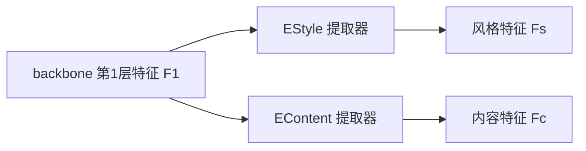

### 背景

继承 Single-DGOD 的目标，现有方法主要有：学习域不变特征，利用视觉语言模型 (CLIP) + 文本 prompt 模拟目标域风格，本文是在后者上的优化。

现有 prompt 方法通常描述简单风格，无法描述比较复杂的组合，导致泛化能力下降

### 创新点

#### ONE：Chain-of-Thought Style Evolution（思维链风格演化）

> 对应论文 **3.1 Chain of Thought-Guided Style Evolution（思维链引导的风格演化）**，是整篇论文最核心的模块。


**要解决的问题：**

> 如何利用文本信息生成更加丰富的**未知域 style（风格）**，让检测模型提前见过各种可能的测试域。

**传统做法（一步式 prompt）：**

- “Driving on a rainy night” → 送入 CLIP → 得到一个 style feature

**问题**：一个 prompt 只能描述一个固定域，像 rainy、night、fog 这类复杂组合无法被充分覆盖。

**作者的核心思路**：让风格描述**逐步进化**——简单描述（关键词）→ 短语描述 → 完整场景描述。

##### 1. 左上：构造三个层级的文本 prompt

第一层（词级）：Night, Dusk, Fog, Rainy, Driving

对应公式：

$$
F_t^1=\sum E_{text}(W_i^r)
$$

即从多个词库中随机取词（weather 词库：rainy / foggy；time 词库：night / dusk；action 词库：driving…），送入 CLIP 文本编码器，得到**初始 style 文本特征** $F_t^1$。

##### 2. 第一阶段：关键词 → 短语

原始关键词：Night / Rainy / Driving，通过 ChatGPT 组合成具有语义关系的场景描述：“Driving down the road on a rainy night”，再输入 $E_{text}$（CLIP Text Encoder）得到 $E_{text}(P_r)$，与第一阶段的特征融合：

$$
F_t^2=E_{text}(P_r)+F_t^1
$$

> 这里的 + 不是文本相加，而是 **feature embedding 相加**。$F_t^2$ 同时包含 rainy / night / driving 以及 road 的场景关系。

##### 3. 第二阶段：短语 → 完整描述

继续加入天气强度、遮挡、物体、环境等细节：“Driving on a rainy night, heavy rain poured down, with pedestrians and vehicles on the road”，得到最终 style 语义：

$$
F_t^3=E_{text}(S_r)+F_t^2
$$

##### 4. 为什么要三个阶段？

不是直接告诉模型“这是雨夜”，而是让模型逐渐学习：雨 → 雨夜驾驶 → 雨夜驾驶 + 大雨 + 行人 + 车辆 + 低能见度。style distribution 逐渐扩大，像 style space 中由内向外扩散的点，**逐步覆盖更多未知域**。

##### 5. 下半部分：图片分支

源域图片（如晴天）进入 $E_{img}$（CLIP Image Encoder），得到真实图片的视觉 feature $F_{img}$。

##### 6. 为什么图片和文本要连接？

希望文本描述的 style 与图片 feature 中的 style 保持一致——文本说 rainy night，就希望图片 feature 也变成 rainy night style。因此中间学习一组可调节的风格参数 $\mu_t, \sigma_t$。

##### 7. 学习 μ 和 σ（重点，AdaIN 思想）

借用 **AdaIN（Adaptive Instance Normalization）**：

1. 图片 feature 先标准化，去掉原来的 style：

$$
F'=\frac{F-\mu(F)}{\sigma(F)}
$$

2. 再重新加入文本提供的 style 参数：

$$
F_i=\sigma_t F'_{img}+\mu_t
$$

即原图片“晴天街道”变成“雨夜街道”，而车、人这些内容保持不变。

为什么**AdaIN**可以去风格？

**AdaIN 能去风格，是因为在 CNN 特征里风格主要就藏在逐通道的均值/方差里；归一化等于把这些“外观统计量”抹平，剩下空间结构就是内容**

##### 8. Consistency Loss 作用

约束生成后的视觉 style feature 与文本 style feature 保持一致：

$$
L_{tc}=1-sim(F_i,F_t^3)
$$

（cosine similarity）目标：让 视觉 style ≈ 文本 style。

##### 9. GD update 是什么意思？

即梯度下降（Gradient Descent）。训练时固定图片和 CLIP encoder，只学习 $\mu_t,\sigma_t$：第一次 rainy style 不像 → 调整 μ σ → 第二次更像 rainy → 继续优化 → 最终得到一组 style 参数。

**注意**：每一种风格都对应一组 $(\mu_t,\sigma_t)$

##### 10. 最终训练阶段怎么用？

训练检测器时，**随机选择学习到的 $(\mu_t,\sigma_t)$** 对源图片做 style 迁移：晴天汽车图片 → 雨天汽车 / 夜晚汽车 / 雾天汽车。检测器因此提前见过更多 domain，泛化能力提升。

**3.1 模块总结：**

> 作者利用 ChatGPT 生成逐步增强的文本描述，通过 CLIP 编码得到逐渐丰富的 style embedding，再利用 AdaIN 学习文本指导的 style 参数（μ、σ），将源域图像风格迁移到未知域，使模型在训练阶段提前接触多样化 style，从而提升 Single-DGOD 泛化能力。

**与 CDSD（Wu CVPR 2022）对比：**

|          | Wu CVPR 2022 (CDSD)                                    | 本篇 (SE-COT)                               |
| -------- | ------------------------------------------------------ | ------------------------------------------- |
| 核心做法 | 图片 feature 解耦出 domain-invariant + domain-specific | 文本 → CLIP → 生成未知 style → 增强训练数据 |
| 目标     | **消除 domain bias**（找到不变特征）                   | **扩大 domain coverage**（主动制造未知域）  |
| 关键工具 | —                                                      | CLIP（文本编码）+ ChatGPT（生成描述）       |

#### TWO：Style Disentanglement Module（风格解耦模块）

> 对应论文 **3.2 Style Disentangled Module（风格解耦模块）**。解决 3.1 的副作用：直接对特征做 AdaIN 风格迁移会**连语义一起破坏**，所以先解耦，只对“风格部分”做演化。

**模块定位**：

```
3.1 造出风格参数 (μ_t, σ_t)
        ↓
3.2 把特征拆成 风格 Fs + 内容 Fc   ← 本模块
        ↓
只对 Fs 做 AdaIN 演化，Fc 原样保留 + 原型增强(3.3)
        ↓
合并 → 送回 backbone 2~4 层 → RPN → 检测
```

**结构：两个提取器，作用在第一层特征 F1**：



对应公式 (7)：

$$
F_s=E_{Style}(F_1), \quad F_c=E_{Content}(F_1)
$$

- **F_s（风格）**：装天气、光照、纹理等外观信息 → 给 3.1 的 AdaIN 去“换风格”
- **F_c（内容）**：装物体形状、类别、位置等语义 → 保持不动，防止风格迁移毁掉检测目标

##### 三个 Loss 保证“解耦干净”

| Loss                     | 公式                                                                                                    | 作用                                                              | 直觉                                                      |
| ------------------------ | ------------------------------------------------------------------------------------------------------- | ----------------------------------------------------------------- | --------------------------------------------------------- |
| **对比损失 L_d** (8)     | $L_d=-\log\frac{\exp(sim(F_1,F_s)/\tau)}{\sum_{j=0}^{1}\exp(sim(F_1,P[j])/\tau)}$，$P=[F_s,F_c]$，τ=1.0 | 拉近 $F_1\leftrightarrow F_s$，推远 $F_1\leftrightarrow F_c$      | 逼风格分支充分代表 F1、内容分支与它方向互斥，解耦本身成立 |
| **风格一致性 L_sc** (9)  | $L_{sc}=1-sim(F_s,F_{ts})$                                                                              | 让 F_s 对齐源域文本描述（“sunny / day / realistic” 的 CLIP 特征） | 保证 F_s 里装的确实是“风格”                               |
| **内容一致性 L_gc** (10) | $L_{gc}=1-sim(Down(F_p),F_c)$                                                                           | 让 F_c 对齐类特定原型 $F_p$（3.3 聚类得到，降采样到 F_c 维度）    | 保证 F_c 里装的是“类别语义”                               |

##### 为什么 L_d 要“拉近 F1↔Fs、推远 F1↔Fc”？

**拉近 F1↔Fs（风格分支要“像”原图）**：

1. 第一层特征的外观主体就是风格（颜色、亮度、纹理）——风格分支最能代表 F1，符合数据本质；
2. 给 AdaIN 一个“可换的底子”：$F_s$ 与 $F_1$ 方向一致，换 μ、σ 才是真的在换这张图的风格；
3. 解耦的本质是分工：若两分支都贴近 F1 则互为冗余，解耦是空话。

**推远 F1↔Fc（内容分支要“不像”原图）**：

1. 防止内容分支“偷渡”源域外观：若 $F_c\approx F_1$，源域风格会顺着内容分支原封不动漏进检测器，风格迁移白做；
2. 强迫两分支不对称——不对称才是解耦；
3. 内容的“语义锚”由 L_gc 兜底：推远只洗掉外观，$F_c$ 被 L_gc 拽向类原型，落在“纯语义”方向。

```
特征空间（cos 相似度只看方向）
        F_s（贴近 F1 方向，代表外观）↑
        F1 ───────→（原图，裁判）
        F_c（远离 F1 方向，代表语义，由类原型 L_gc 锚定）
```

**一负一正的分工**：

```
L_d 推远 F1↔Fc → 负向约束：Fc 里【不要】外观（防偷渡）
L_gc 拉近 Fp↔Fc → 正向约束：Fc 里【要有】类别语义（防推飞后没内容）
```

> Fc = 不含外观（L_d）+ 含类别信息（L_gc）；Fs = 贴近外观（L_d）+ 对得上文本（L_sc）。

##### 完整数据流（3.2 + 前后衔接）

```
源域图片（晴天）
    ↓ backbone 第1层（CLIP 预训练权重，训练时冻结）
  F1
    ├─ EStyle ─→ Fs ──→ AdaIN: Fi = σt·(Fs−μ(Fs))/σ(Fs) + μt   ← 3.1 演化，只动风格
    │                  （随机选一组 (μt,σt)，每次迭代换一种风格）
    └─ EContent ─→ Fc ──→ 与类原型 Fp 融合增强 → Fc′            ← 3.3 增强
    ↓
  合并 Fs′ + Fc′
    ↓ 送入 backbone 第 2~4 层
  RPN → 分类 + 定位（Faster R-CNN）
```

**3.2 模块总结：**

> 用两个提取器把第一层特征拆成风格/内容，靠**对比损失（保解耦）+ 风格一致性（对齐源域文本）+ 内容一致性（对齐类别原型）**三个损失监督；之后风格演化（3.1）只作用在 F_s 上、原型增强（3.3）只作用在 F_c 上，合并后再进主干——“换风格”的同时，检测语义（车、人、位置）一点不丢。

**实现细节**：检测器用 CLIP 预训练初始化，**第 1~3 层权重冻结**，解耦模块架在第一层特征之上——解耦提取器是“搭在冻结主干上”学的，避免解耦过程反向破坏骨干的通用表示。

#### THREE：Class-Specific Prototype Clustering Module（类特定原型聚类模块）

> 对应论文 **3.3 Class-Specific Prototype Clustering Module**。解决 3.2 之后的问题：$F_c$ 虽然“没有风格了”，但怎么保证它“有正确的类别语义”？——为每个类别维护一个**跨域稳定的语义锚点**（原型 $F_p$）。

**模块定位（原型 Fp 干两件事）**：

1. **当监督信号**：3.2 的 $L_{gc}=1-sim(Down(F_p),F_c)$ 用它把内容特征拽向类别语义；
2. **增强内容特征**：原型信息融合回特征图，突出前景（物体）特征。

> 论文原文：“captures inherent invariant characteristics across different categories”——原型抓的是**跨域不变的类别特征**（晴天的车和雨夜的车，类别本质一样）。

##### 具体流程（5 步）

**Step 1：软分配（Soft Assignment）**——公式 (11)

```
F（输入特征图）
  ↓ L2 归一化
  ↓ 1×1 卷积降维（通道数对齐到 K）
  ↓ Softmax
θ = ConvSoftmax(L2(F))
```

- 输出 $\theta \in \mathbb{R}^{H\times W \times K}$：**每个像素属于 K 个原型（= 类别数）的概率**

**Step 2：可学习聚类中心 sp**——公式 (12)

- 初始化可学习聚类中心张量 $sp \in \mathbb{R}^{K \times C}$，扩成 $(N, K, C)$；
- 计算**每个像素与每个聚类中心的残差，并用软分配概率加权**（原文：“Residuals between each prototype and pixel are computed and weighted by the soft assignment probabilities”）：

$$
F_{p1} = \theta \odot (Resize(\theta) - Resize(sp))
$$

**Step 3：聚合 + 归一化**——公式 (13)

- 残差按原型求和 → 形状 $(N, K, C)$，L2 归一化后展平成 $(N, K \times C)$：

$$
F_{p2} = L2(Resize(L2(sum(F_{p1}))))
$$

**Step 4：线性投影 + 空间展开**——公式 (14)

- 过全连接层 → 重整为 $(N, K, C)$ → 展开回原特征图空间尺寸：

$$
F_{p3} = Resize(Linear(F_{p2}))
$$

**Step 5：原型增强特征图**——公式 (15)

- 把 $F_{p3}$ 和原特征 $F$ 沿通道拼接，用卷积压回原通道数：

$$
F_p = Conv(Cat(F, F_{p3}))
$$

- 结果：**“better highlights the features of the foreground”**——前景（物体）特征被原型信息点亮。

##### 数据流全景（3.3 在整篇中的位置）

```
3.2 解耦出的内容特征 Fc
   ↓
F（原特征图）─→ 3.3 原型聚类 ─→ Fp
   │                          │
   │            ┌─────────────┤
   │            ↓             ↓
   │     Lgc 监督 Fc（3.2）   增强内容特征 Fc′（合并回主干）
   │                          ↓
   └─→ 与风格演化后的 Fs′ 融合 → backbone 2~4 层 → 检测
```

**3.3 模块总结：**

> 用“软分配 + 残差加权聚类”为每个类别学出跨域稳定的原型 Fp：向下给 3.2 的 L_gc 当“内容应该长什么样”的监督信号，向上把类别信息融合回特征图增强前景，让模型在风格千变万化的同时，**类别语义有锚可依**。

### 模型选择：

检测头 Detector --> Faster R-CNN

视觉语言模型 CLIP——对文本编码，指导 style evolution

文本 prompt → CLIP Text Encoder → style feature → 指导 style evolution

大模型 Chat GPT——生成 style 描述，用于**ONE：Chain-of-Thought Style Evolution（思维链风格演化）**

### 网络架构（冻结/未冻结标注）

```
输入图像（源域：白天晴天）
   ↓
Backbone Stage 1（❄️ 冻结，CLIP 权重）→ F1
   ↓（第 1 层出口【拦截】：F1 转去旁路加工）
┌────────────────────────────────────────────┐
│ 旁路加工（训练期插入的工序）                    │
│  解耦：EStyle → Fs（🔥）│ EContent → Fc（🔥）  │
│  Fs → AdaIN 注入 ←── (μt,σt)               │
│  Fc → 类特定原型增强（🔥）                    │
│  合并 Fs′ + Fc′                             │
└────────────────────────────────────────────┘
   ↓（续走：第 2~4 层只在这里走【一次】）
Backbone Stage 2（❄️）→ Stage 3（❄️）→ Stage 4（🔥）
   ↓
RPN + 检测头（🔥 未冻结）
   ↓
预测框 + 类别

── 训练期旁路 ─────────────────────────────
图像字幕模型（🔇 不参与训练，只生成词）
ChatGPT（🔇 不参与训练，只生成描述）
CLIP 文本编码器（❄️ 冻结，预训练）
风格参数 (μt,σt)（阶段A 🔥 训练 / 阶段B ❄️ 冻结）
```

> **理解要点**：这仍然是一次前向——图像只走到 Stage 1 出口就被拦截加工，加工完从 Stage 2 续走到底；**Stage 2~4 在整个前向里只被走一次**（不是图像先完整走一遍再加工）。

**冻结状态一览表**：

| 组件               | 状态                  | 说明                                        |
| ------------------ | --------------------- | ------------------------------------------- |
| Backbone 第 1 层   | ❄️ 冻结               | CLIP 预训练权重，不动                       |
| Backbone 第 2~3 层 | ❄️ 冻结               | 论文明确 “layers 1 through 3 remain frozen” |
| Backbone 第 4 层   | 🔥 未冻结             | 推测（论文只说 1-3 冻结，未提第 4 层）      |
| EStyle / EContent  | 🔥 未冻结             | 解耦提取器，训练                            |
| 类特定原型         | 🔥 未冻结             | 聚类 + 增强模块，训练                       |
| RPN + 检测头       | 🔥 未冻结             | 标准检测组件                                |
| 风格参数 (μt, σt)  | 🔥 阶段 A / ❄️ 阶段 B | 先独立训练，检测训练时固定                  |
| CLIP 文本编码器    | ❄️ 冻结               | 预训练文本编码                              |
| ChatGPT / 字幕模型 | 🔇 不参与训练         | 纯生成工具（无梯度）                        |

**关键设计解读**：

1. **冻结 1-3 层 = “解耦模块架在冻结主干上”**：避免解耦过程反向破坏骨干的通用表示；
2. **两阶段冻结切换**：风格参数阶段 A 训练完就冻结——检测训练只“用”不“改”；
3. **可训练参数很少**：只有解耦器 + 原型 + 第 4 层 + 检测头。

### 训练流程（两阶段）

**阶段 A：风格演化阶段（Style Evolution Stage）——先独立训练风格参数**

```
① 图像字幕模型（增强版）从源域图生成相关词（sunny/day/realistic）
② ChatGPT 扩成 5 个词库（weather/time/style/action/detail）
③ CoT 三级演化：随机选词 → ChatGPT 短语 → 细节词 → 句子
   文本特征逐级累加：Ft1 → Ft2 → Ft3（CLIP 编码）
④ 用文本特征训练风格参数 (μt, σt)（各 256 通道）
   优化器：SGD（lr=1.0，momentum=0.9，wd=0.0005）
   监督：一致性损失 Ltc = 1 − sim(Fi, Ft3)——让 AdaIN 结果贴近文本风格
⑤ 每条文本描述得到一组 (μt, σt) → 多组风格参数库
```

**阶段 B：风格迁移阶段（Style Transfer Stage）——检测训练**

```
每个训练迭代：
① 从已学好的多组风格参数中【随机选一组】(μt, σt)
② 对解耦出的风格特征 Fs 做 AdaIN：Fi = σt·(Fs−μ(Fs))/σ(Fs) + μt
③ 内容特征 Fc 用类特定原型增强（3.3）
④ 风格特征 + 内容特征合并 → 送入 backbone 2~4 层 → RPN → 检测
⑤ 联合优化：检测损失 + 解耦损失 + 一致性损失
```

**训练细节**：Faster R-CNN + CLIP 预训练初始化（第 1~3 层冻结），单张 3090，batch size 2。

> 两阶段的关键：**风格参数先独立学（检测器冻结），检测训练时只“用”风格参数**（随机抽组做迁移）——风格模拟和检测学习解耦开。

### 推理流程（标准单次前向）

**论文未设专门推理小节——推理 = 训练好的检测器做标准前向**：

```
测试图（夜晚/雨/雾，未知域）
   ↓ backbone 第 1 层（冻结的 CLIP 权重）
   ↓ 风格/内容解耦（Es/Ec）→ 取内容特征 Fc（风格演化不再使用）
   ↓ 类特定原型增强内容特征（3.3，训练学好的原型）
   ↓ backbone 2~4 层 → RPN → 检测头
   ↓ 输出框 + 类别
```

**关键点**：

1. **风格演化装置全部退场**：不跑 CLIP 文本编码、不生成 (μt,σt)、不做 AdaIN——风格模拟只发生在训练期；
2. **推理只用训练练出的能力**：原型增强的内容特征 + 已被风格多样性训练过的检测器；
3. **标准单次前向、零测试时开销**（同 CDSD/Cauvis 一派，区别于 LTFE 的 2 步演化）。

### 数据集

两个 benchmark

**Dataset 1：Diverse Driving Weather Scenarios**

来自 Single-DGOD 数据集。训练只有 Daytime Sunny，测试四种未知天气，七种目标类别

**Dataset 2：Reality-to-Art**

训练：PASCAL VOC2007 + VOC2012。

测试：三个未知艺术域，

### 评价指标

mAP@0.5（IoU 阈值 0.5 的均值平均精度，按所有类别平均）

### 实验部分（论文 Section 4）

#### 4.1 实验设置

| 项目       | 设置                                                                                                                                                                                  |
| ---------- | ------------------------------------------------------------------------------------------------------------------------------------------------------------------------------------- |
| **基准 1** | Diverse Driving Weather：训练只用 **Daytime Sunny**（19,395 训练 + 8,313 验证）；测试 4 个未知域（Night Clear 26,158 / Dusk Rainy 3,501 / Night Rainy 2,494 / Day Foggy 3,775），7 类 |
| **基准 2** | Reality-to-Art：训练 PASCAL VOC2007+2012；测试 Clipart1k（20 类）、Watercolor2k（6 类）、Comic2k（6 类）                                                                              |
| **指标**   | mAP@0.5                                                                                                                                                                               |
| **检测器** | Faster R-CNN，骨干 Res50 / Res101 / Swin-T 三档                                                                                                                                       |

#### 4.2 实现细节（关键点）

- 检测器 **CLIP 预训练初始化，第 1~3 层权重冻结**（解耦模块架在冻结主干上）
- 风格参数 $(\mu_t,\sigma_t)$ 各 **256 通道**，SGD 优化（lr=1.0，momentum=0.9，wd=0.0005），单张 3090，batch size 2
- 训练两阶段：**风格演化阶段**（学风格参数）→ **风格迁移阶段**（每 iteration 随机抽一组风格参数做迁移，模拟目标域风格空间）

#### 4.3 主结果

**Table 1 — Diverse Weather（mAP%）**：

| 方法             | Day Clear | Night Sunny | Dusk Rainy | Night Rainy | Day Foggy |
| ---------------- | --------- | ----------- | ---------- | ----------- | --------- |
| Faster R-CNN     | 48.1      | 34.4        | 26.0       | 12.4        | 32.0      |
| S-DGOD           | 53.6      | 38.5        | 28.2       | 19.2        | 39.1      |
| UFR              | 48.4      | 33.5        | 38.1       | 16.1        | 36.9      |
| C-Gap            | 52.8      | 42.5        | 33.7       | 24.1        | 37.2      |
| **Ours(Res101)** | 55.4      | **42.0**    | **39.2**   | **24.5**    | **40.6**  |
| **Ours(Swin)**   | 64.4      | **52.7**    | **49.5**   | **33.7**    | **44.9**  |

→ 同骨干（Res101）下 **4 个未知目标域全部第一**，Swin 骨干进一步提升。

**Table 2 — Real-to-Art（mAP%）**：

| 方法             | Comic    | Watercolor | Clipart  |
| ---------------- | -------- | ---------- | -------- |
| C-Gap            | 29.4     | 50.7       | 36.7     |
| **Ours(Res101)** | **34.8** | **57.5**   | **40.2** |
| **Ours(Swin)**   | 36.9     | 60.7       | 42.5     |

→ 比一步式 prompt 的 C-Gap 分别提升 **+18% / +13% / +9%**（论文原文数据），证明 CoT 逐步演化的优势。

**每类 AP 分析**（Table 3/4/5）：

- **Day Foggy**：Ours(Res101) mAP 40.58（Swin 44.99），几乎全部 7 类第一
- **Dusk Rainy**：Ours(Res101) 39.16（Swin 49.45）
- **VOC→Comic**：Ours(Res101) 34.82（Swin 36.92）

#### 4.4 消融实验（Table 6）

| 配置                      | Day Clear | Night | Dusk     | Night Rainy | Foggy    |
| ------------------------- | --------- | ----- | -------- | ----------- | -------- |
| Baseline（Faster R-CNN）  | 49.6      | 34.7  | 25.7     | 11.8        | 28.4     |
| + One-step（一步 prompt） | 52.4      | 36.9  | 28.9     | 14.7        | 32.1     |
| + CGSE（CoT 风格演化）    | 54.2      | 40.7  | 31.2     | 17.9        | 35.7     |
| + SDM（风格解耦）         | 54.7      | 40.2  | 32.8     | 20.6        | 36.2     |
| + CPCM（类原型）          | 56.2      | 42.4  | 36.4     | 22.6        | 38.6     |
| **完整模型**              | 55.4      | 42.0  | **39.2** | **24.5**    | **40.6** |

→ 三个模块都有收益；**CoT 相对一步 prompt 提升显著**（Foggy 32.1→35.7）。

**CoT 层级消融（Figure 6）——关键发现**：

| Level  | 结构                                         | 结果                 |
| ------ | -------------------------------------------- | -------------------- |
| L1     | 一步完整 prompt                              | 最差                 |
| L2     | 词 → 短语                                    | 一般                 |
| **L3** | 词 → 短语 → 句子                             | **最优（论文采用）** |
| L4     | L3 + 更多细节词                              | 下降                 |
| L5     | + 句子模板（“a hard-to-see photo of a ___”） | 进一步下降           |

> 论文解释：层级过多时**过量信息干扰风格演化**（也可能受限于当时语言模型的编码能力）。L3 是“够用且最好”的平衡点。

#### 4.5 可视化分析

- **Figure 4（定性）**：雨夜等低可见度场景，红框 = C-Gap 漏检但 Ours 检出的物体——模型能识别“人眼都难分辨”的目标
- **Figure 5（热力图）**：一步 prompt → 两级 CoT → 三级 CoT，随着层级推进，**模型注意力越来越聚焦前景物体、背景干扰越来越少**——直接可视化验证了 CoT 演化的价值

#### 实验观察

1. **实验设计完整**：双基准（天气 + 艺术）、三骨干、逐类 AP、模块消融、CoT 层级消融、可视化，该有的都有
2. **Night Rainy 依然是最短板**（24.5）——复合退化（暗+雨）对“文本模拟”派仍是硬骨头（后续 LTFE 的时序演化正是冲着这个去的）
3. **源域不掉点**：Day Clear 55.4 高于多数基线，说明风格模拟没有牺牲源域性能
4. **Swin 骨干增益巨大**（Night Rainy 24.5→33.7），论文没深挖原因，可能是更好的底层特征让解耦/迁移更干净

使用 CLIP 和 ChatGPT 生成逐级增强的文本风格描述，通过 Chain-of-Thought 引导未知域风格演化，同时利用 style-content 解耦和类别 prototype 保持目标语义，从而提升单源域目标检测在未知域中的泛化能力。

### 相关资料

- 论文 arXiv：[arXiv:2503.09968](https://arxiv.org/abs/2503.09968)
- 代码仓库：[github.com/ZZ2490/SE-COT](https://github.com/ZZ2490/SE-COT)

### 延伸阅读

本文涉及的知识点与博客对应：

- **AdaIN 风格迁移**（核心机制：文本→风格参数 (μt,σt)→AdaIN 注入）：[AdaIN 风格迁移](https://titroupast.github.io/blog/posts/adain%E9%A3%8E%E6%A0%BC%E8%BF%81%E7%A7%BB/)
- **对比学习**（L_d 对比损失做风格/内容解耦）：[对比学习](https://titroupast.github.io/blog/posts/%E5%AF%B9%E6%AF%94%E5%AD%A6%E4%B9%A0/)
- **Chain-of-Thought**（词→短语→句子的思维链演化）：[推理模型深度思考原理笔记](https://titroupast.github.io/blog/posts/%E6%8E%A8%E7%90%86%E6%A8%A1%E5%9E%8B%E6%B7%B1%E5%BA%A6%E6%80%9D%E8%80%83%E5%8E%9F%E7%90%86%E7%AC%94%E8%AE%B0/)
- **CLIP / ChatGPT**（文本编码与大模型生成）：[学习笔记解析大型语言模型](https://titroupast.github.io/blog/posts/%E5%AD%A6%E4%B9%A0%E7%AC%94%E8%AE%B0%E8%A7%A3%E6%9E%90%E5%A4%A7%E5%9E%8B%E8%AF%AD%E8%A8%80%E6%A8%A1%E5%9E%8B-dissecting-large-language-models/)
